# 从「收藏吃灰」到「知识入库」：用 AI 流水线把微信视频号收藏变成 Obsidian 知识库

> 你的微信视频号收藏了多少视频？几十个？上百个？收藏的时候觉得「这个有用，回头再看」，结果再也没打开过。
>
> 本文介绍一套完整的 AI 自动化方案：批量下载视频号收藏 → 语音转文字 → 智能分类 → 生成结构化笔记 → 导入 Obsidian 知识库。全程本地 GPU 运行 Whisper，配合大模型做内容分析和分类，262 条短视频从原始视频变成可检索、可跳转、可行动的知识体系。
>
> 项目已开源：[github.com/dlv2008/weixin-favor-kb](https://github.com/dlv2008/weixin-favor-kb)

---

# 第一部分：快速开始

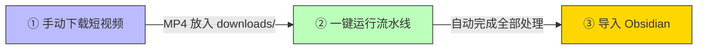

整个过程只有三步。第一步和第三步需要手动操作（下载视频、打开 Obsidian），中间的核心处理——音频提取、语音转文字、关键帧 OCR、LLM 分类与分析、Obsidian Vault 构建——全部自动化，一条命令完成。

## 环境要求

| 项目 | 要求 |
|------|------|
| 系统 | Ubuntu（WSL 亦可），需有 GPU |
| GPU | NVIDIA 显卡，8GB+ VRAM（RTX 3070 Ti 实测可用） |
| Python | 3.10+ |
| ffmpeg | 系统已安装 |
| LLM API | 任意 OpenAI 兼容接口（DeepSeek / 硅基流动 / 智谱 / Ollama 本地 等） |

**费用说明**：Whisper / OCR / ffmpeg 全部免费本地运行。唯一付费项是 LLM API（分类 + 分析 + Vault 汇总），262 个视频处理下来约消耗几毛到几块钱，取决于你选择的模型。

## 克隆与安装

```bash
git clone https://github.com/dlv2008/weixin-favor-kb.git
cd weixin-favor-kb

python3 -m venv venv
source venv/bin/activate

pip install -r requirements.txt
```

核心依赖只有 9 个包：

| 包名 | 用途 |
|------|------|
| `faster-whisper` | 基于 CTranslate2 的 Whisper 实现，支持 int8 量化 |
| `opencv-python-headless` | 关键帧提取，场景变化检测 |
| `rapidocr-onnxruntime` | 轻量 OCR，识别视频画面中的文字 |
| `openai` | OpenAI 兼容 API 客户端 |
| `jinja2` | 模板引擎，渲染 Obsidian 笔记 |
| `pyyaml` | 配置文件解析 |
| `numpy` | 数值计算 |
| `loguru` | 日志 |
| `rich` | 终端美化（进度条、表格报告） |

## 下载视频

使用 [wx_channel](https://github.com/nobiyou/wx_channel)（微信视频号下载助手）在 Windows 上批量下载收藏视频：

1. 前往 [GitHub Releases](https://github.com/nobiyou/wx_channel/releases) 下载最新版 `wx_channel.exe`
2. **以管理员身份运行**
3. 在微信中打开视频号 → 进入「我的收藏」页面
4. 工具自动注入下载按钮，点击批量下载


下载完成后，视频按作者名分类保存。将整个目录复制到 WSL 的工作目录：

```bash
cp -r /mnt/c/Users/你的用户名/下载目录/ ~/temp/weixin-favor-kb/downloads/
```

## 配置 config.yaml

整个项目只有一个配置文件。编辑 `config.yaml`，填入你的 LLM API 信息：

```yaml
whisper:
  model_size: "large-v3"       # Whisper 模型，中文效果最佳
  device: "cuda"                # 使用 GPU
  compute_type: "int8_float16"  # 8GB 显卡用 int8 量化
  language: "zh"

llm:
  api_key: "你的API密钥"                   # 必填
  base_url: "https://api.openai.com/v1"    # 或 DeepSeek / 硅基流动 等
  model: "gpt-4o"                          # 或其他模型

frames:
  threshold: 30.0   # 场景变化阈值
  max_frames: 20    # 每个视频最多提取 20 帧

ocr:
  confidence_threshold: 0.5

paths:
  downloads: "./downloads"
  output: "./output"
```

> 所有脚本（pipeline.py、build_vault.py、reclassify.py）统一从 `config.yaml` 读取 LLM 配置，无需额外设置环境变量。

LLM 提供商参考：

| 方案 | 费用 | base_url |
|------|------|----------|
| DeepSeek | 极低 | `https://api.deepseek.com/v1` |
| 硅基流动 | 注册送额度 | `https://api.siliconflow.cn/v1` |
| Ollama 本地 | 免费 | `http://localhost:11434/v1` |
| 智谱 GLM | 有免费额度 | `https://open.bigmodel.cn/api/paas/v4` |

## 一键运行

```bash
./run.sh ./downloads/
```

这一条命令会自动完成：

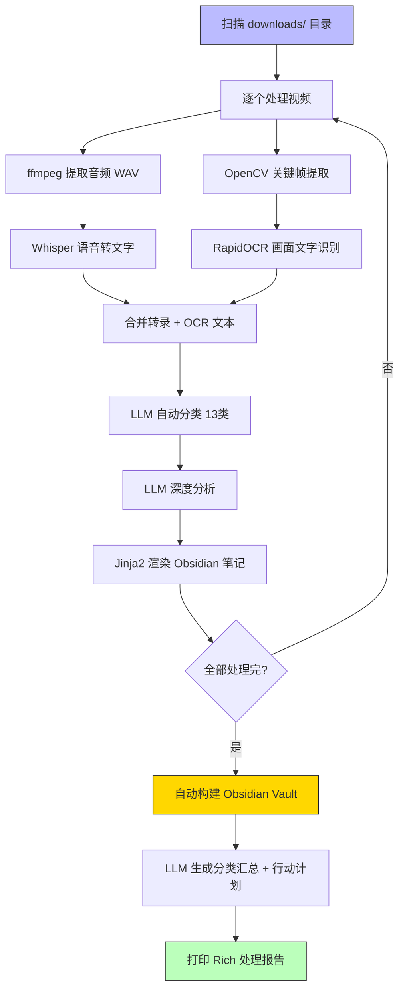


处理完成后会打印 Rich 表格报告，显示每个视频的分类和标签。

> **WSL 用户注意**：`run.sh` 会在 Python 启动前注入 CUDA 库路径。如果你的 WSL 环境中 CUDA 库不在系统路径中，需要编辑 `run.sh` 中的 `CUDA_BASE` 路径，指向你系统中的 NVIDIA 库目录。

## 导入 Obsidian

```bash
# WSL 环境下复制到 Windows
cp -r obsidian_vault /mnt/c/Users/你的用户名/Documents/
```

然后在 Obsidian 中打开：

1. 启动 [Obsidian](https://obsidian.md)
2. 「管理仓库」→「打开本地仓库」
3. 选择刚才复制的 `obsidian_vault` 文件夹


> 不要通过 `\\wsl$\` 路径直接打开 WSL 目录，Obsidian 的文件监视器不支持 WSL 网络文件系统，会报 `EISDIR` 错误。

---

# 第二部分：使用效果

## Obsidian 首页

打开 vault 后看到的是知识库总览页：


首页展示全局统计（261 篇笔记、955 个标签、751 条资源），以及 13 个分类入口。每个分类标注了笔记数量，点击即可跳转。

## 分类页：知识全景 + 行动计划

每个分类页由 LLM 综合该类下所有笔记生成，包含两个核心部分：

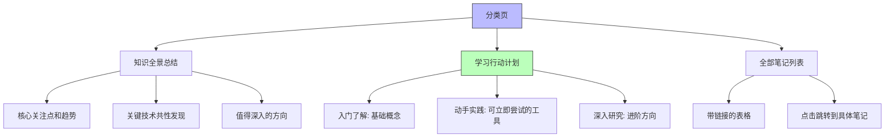

以 AGENT 分类为例（64 篇笔记），LLM 生成的知识全景总结：

- **核心趋势**：2025-2026 年 AI Agent 从「框架热」转向「工程化」，三大趋势——技能生态化、多智能体专业化、本地化部署
- **技术共性**：上下文工程、工具编排、状态管理等六大核心模块
- **行动计划**：从入门（阅读 Anthropic《Building Effective Agents》）到实践（部署 OpenManus）到深入（研究 Claude Code 六层记忆架构）


每个行动项都标注了来源笔记编号和具体的 GitHub 仓库名，可以直接找到来源并开始实验。

## 笔记页：结构化知识卡片

点击分类表中的链接，跳转到具体笔记。每篇笔记的结构：

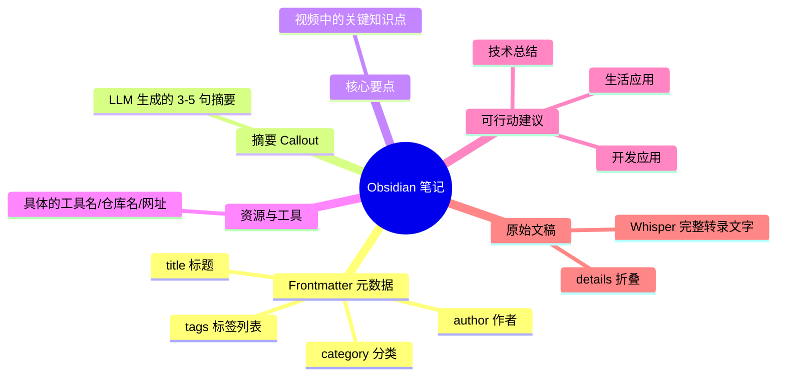

- **Frontmatter**：YAML 元数据，Obsidian 可直接识别 `tags` 和 `category`
- **Callout**：`> [!summary]` 渲染为带颜色的提示框
- **Checkbox**：`- [ ]` 是 Obsidian 原生任务列表，可直接勾选
- **Details 折叠**：原始转录文字用 HTML `<details>` 折叠

## 笔记间的链接跳转


Obsidian 的核心能力是双向链接。在分类页点击 `[[笔记名]]` 跳转到具体笔记，笔记中的标签也可以反向检索所有关联笔记。

## 13 个分类体系

经过反复调优，最终确定了 13 个分类：

| 分类 | 定义 | 篇数 |
|------|------|------|
| **AGENT** | AI 智能体开发、Skills、MCP、Claude Code | 64 |
| **AI/ML** | 大模型通用、模型训练、AI 行业趋势 | 54 |
| **感悟** | 个人成长、心理疗愈、认知觉醒 | 35 |
| **生活技巧** | 健康养生、职场、社保、科普 | 24 |
| **其他** | 无法归类 | 21 |
| **RAG** | 检索增强生成、向量检索、知识库问答 | 21 |
| **创富** | 创业、投资理财、运营、副业 | 10 |
| **开发** | 通用开发工具、GitHub 项目、建站 | 9 |
| **前端** | React/Vue/TypeScript、CSS、UI 框架 | 8 |
| **运动** | 徒步、骑行、自驾攻略 | 8 |
| **文史哲** | 历史故事、哲学思想、文学诗词 | 3 |
| **DevOps** | 运维、HTTPS、CI/CD、云服务 | 2 |
| **后端** | 数据库、API 设计、系统设计 | 2 |

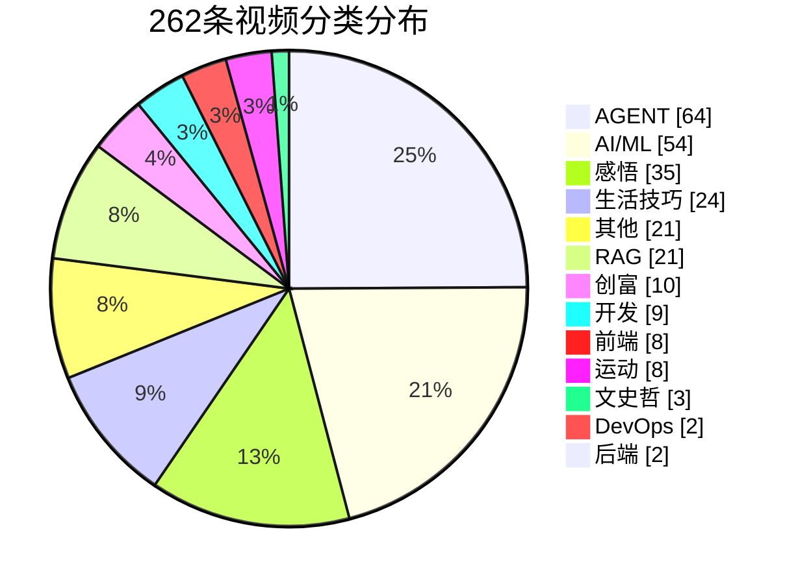

### 分类边界规则

LLM 分类时使用的 6 条关键区分规则：

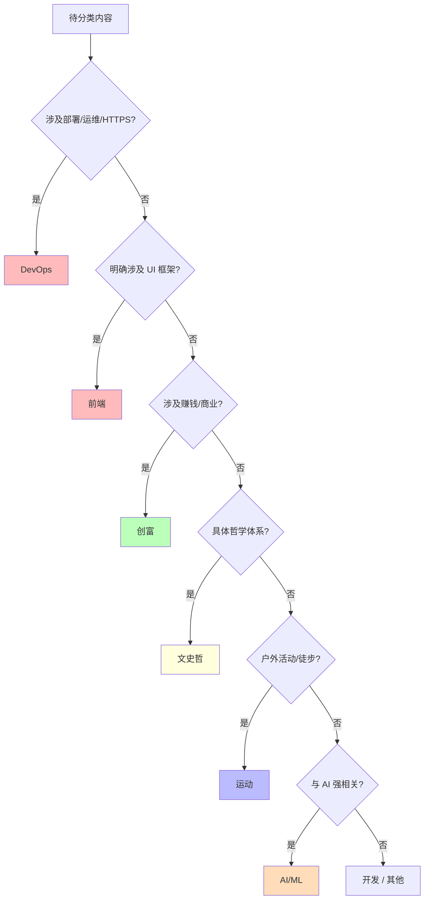

- **开发 vs DevOps**：工具/GitHub 项目 → 开发；部署/HTTPS/服务器 → DevOps
- **创富 vs 感悟**：涉及赚钱/商业 → 创富；纯心灵感悟 → 感悟
- **文史哲 vs 感悟**：具体哲学体系（王阳明/国学）→ 文史哲；个人情感 → 感悟
- **运动 vs 生活技巧**：户外活动 → 运动；健康知识/社保 → 生活技巧
- **开发 vs AI/ML**：与大模型强相关 → AI/ML；通用工具 → 开发

---

# 第三部分：代码详解

## 项目结构

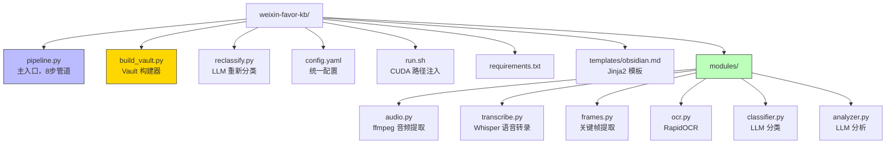

数据流向：

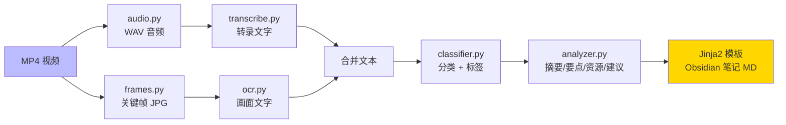

## 主流程 pipeline.py

`pipeline.py` 是整个流水线的入口，负责协调所有模块。

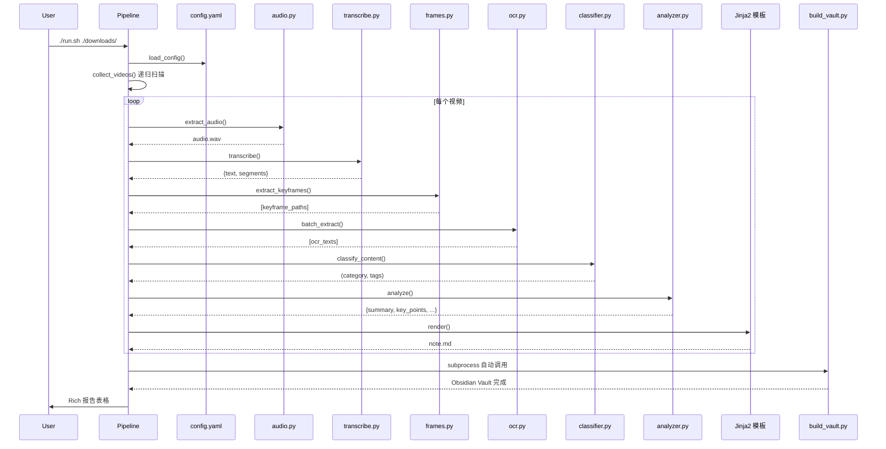

### 配置加载

```python
def load_config(config_path: str) -> dict:
    defaults = {
        "whisper": {"model_size": "large-v3", "device": "cuda", ...},
        "llm": {"api_key": "", "base_url": "...", "model": "gpt-4o"},
        ...
    }
    if path.exists():
        user_config = yaml.safe_load(f)
        _deep_merge(defaults, user_config)
    return defaults
```

设计思路：定义完整的默认配置，用户只需在 `config.yaml` 中写需要覆盖的字段。`_deep_merge` 递归合并，避免用户遗漏某个子字段就全盘失效。

### 视频收集

```python
def collect_videos(input_path: str) -> list[Path]:
    videos = sorted(
        f for f in p.rglob("*")
        if f.is_file() and f.suffix.lower() in VIDEO_EXTENSIONS
    )
```

`rglob("*")` 递归扫描，适配 wx_channel 按作者名分类的多层目录结构。

### process_video：8 步管道

每个视频经历 8 个步骤：

1. **ffmpeg 提取音频** → `audio.wav`
2. **Whisper 转录** → `{"text": "...", "segments": [...]}`
3. **OpenCV 关键帧** → `[keyframe_000.jpg, ...]`
4. **RapidOCR** → `[ocr_text1, ...]`
5. **LLM 分类** → `("AGENT", ["Claude Code", "MCP"])`
6. **LLM 分析** → `{summary, key_points, resources, action_items}`
7. **保存转录稿** → `output/transcripts/xxx.txt`
8. **Jinja2 渲染** → `output/notes/xxx.md`

任何一步异常，整个视频标记为 `failed` 并跳过，不影响后续视频处理。

### 自动构建 Vault

```python
if any(r["status"] == "success" for r in results):
    subprocess.run([sys.executable, "build_vault.py"])
```

只要有视频处理成功，pipeline 结束后自动调用 `build_vault.py` 构建 Obsidian Vault。用户无需手动执行。

## 音频提取 modules/audio.py

```python
cmd = [
    "ffmpeg",
    "-i", str(video),
    "-vn",                   # 丢弃视频流
    "-acodec", "pcm_s16le",  # PCM 16-bit 编码
    "-ar", "16000",          # 16kHz 采样率
    "-ac", "1",              # 单声道
    "-y",
    str(output),
]
```

三个关键参数：
- **`-ar 16000`**：Whisper 模型在 16kHz 下训练，采样率不匹配会显著降低准确率
- **`-ac 1`**：Whisper 内部会将输入转为单声道，提前转换省去运行时开销
- **`pcm_s16le`**：无损 PCM 编码，避免压缩引入的额外噪声

超时设为 600 秒，足以覆盖 1 小时的视频。

## 语音转文字 modules/transcribe.py

### 延迟加载

```python
class Transcriber:
    def __init__(self, model_size, device, compute_type):
        self._model = None  # 不在 __init__ 中加载

    def _load_model(self):
        if self._model is not None:
            return
        _ensure_cuda_libs()
        from faster_whisper import WhisperModel
        self._model = WhisperModel(
            self.model_size,
            device=self.device,
            compute_type=self.compute_type,
        )
```

`_model` 初始为 `None`，首次调用 `transcribe()` 时才加载。这样 `import` 时不占显存，多个 Transcriber 实例也不会重复加载。

### CUDA 路径注入

WSL 环境下 `ctranslate2`（faster-whisper 底层引擎）可能在 Python 启动时就加载 CUDA 库。如果 `LD_LIBRARY_PATH` 中找不到，直接崩溃。解决方案是在 `_load_model()` 前注入路径：

```python
def _ensure_cuda_libs():
    if os.environ.get("_CUDA_LIBS_INJECTED"):
        return
    # 扫描 CUDA_FALLBACK_DIRS，将找到的 lib 目录加入 LD_LIBRARY_PATH
    ...
    os.environ["_CUDA_LIBS_INJECTED"] = "1"
```

用 `_CUDA_LIBS_INJECTED` 标记位防止重复注入。

### int8 量化

```python
compute_type="int8_float16"
```

large-v3 模型全精度需要 ~10GB 显存。`int8_float16` 量化后仅需 ~3GB，在 8GB 显卡上留出足够余量给 OCR 和系统开销。精度损失在中文场景下可忽略。

### VAD 过滤

```python
segments_iter, info = self._model.transcribe(
    str(audio),
    language="zh",
    beam_size=5,
    vad_filter=True,
    vad_parameters=dict(
        min_silence_duration_ms=500,
        speech_pad_ms=200,
    ),
)
```

- **`vad_filter=True`**：自动检测语音段，跳过静音。短视频常有几秒片头空白，VAD 可以精准裁掉
- **`beam_size=5`**：beam search 宽度，5 是速度与准确率的平衡点
- **`language="zh"`**：显式指定中文，避免模型自动检测带来的开销和误判

## 关键帧提取 modules/frames.py

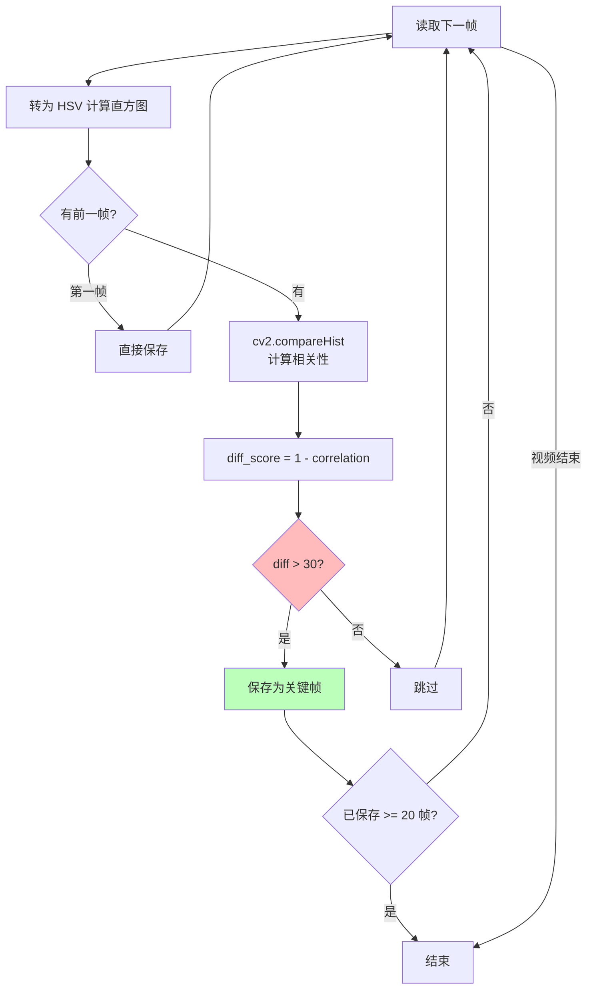

### 算法原理

```python
def _compute_hsv_histogram(frame):
    hsv = cv2.cvtColor(frame, cv2.COLOR_BGR2HSV)
    hist = cv2.calcHist([hsv], [0, 1], None, [50, 60], [0, 180, 0, 256])
    cv2.normalize(hist, hist)
    return hist.flatten()
```

1. 将 BGR 帧转为 HSV 色彩空间（HSV 对光照变化更鲁棒）
2. 计算 H 和 S 通道的 2D 直方图（50×60 = 3000 维特征向量）
3. 归一化后作为帧的「视觉指纹」

```python
correlation = cv2.compareHist(prev_hist, current_hist, cv2.HISTCMP_CORREL)
diff_score = (1.0 - correlation) * 100.0

if diff_score > threshold:  # 默认 30
    save_frame(...)
```

`HISTCMP_CORREL` 返回 [-1, 1] 的相关系数。转换为百分比差异后，阈值 30 表示「视觉内容变化超过 30%」时判定为场景切换。

### 为什么不用 SSIM 或像素差异

- **直方图**：对平移、缩放有一定容忍度，计算快
- **SSIM**：更精确但慢 10 倍，关键帧提取不需要像素级精度
- **像素差异**：对光照变化极其敏感，误报率高

`max_frames=20` 是安全上限，防止某些快速剪辑视频产生数百帧。

## OCR modules/ocr.py

```python
class OCRProcessor:
    def extract_text(self, image_path: str) -> str:
        result, _ = self._engine(str(img))
        texts = [item[1] for item in result if item[2] >= self.confidence_threshold]
        return " ".join(texts)

    def batch_extract(self, image_paths: list[str]) -> list[str]:
        for path in image_paths:
            results.append(self.extract_text(path))
        return results
```

同样采用延迟加载。`confidence_threshold=0.5` 过滤掉低置信度的噪声结果（模糊帧、纯色背景误识别等）。

为什么需要 OCR？很多技术视频在画面中展示代码、PPT、架构图，这些视觉信息是纯语音转文字无法获取的。OCR 把画面文字补充进来，让 LLM 分析时有更完整的上下文。

## LLM 分类 modules/classifier.py

### 无限重试机制

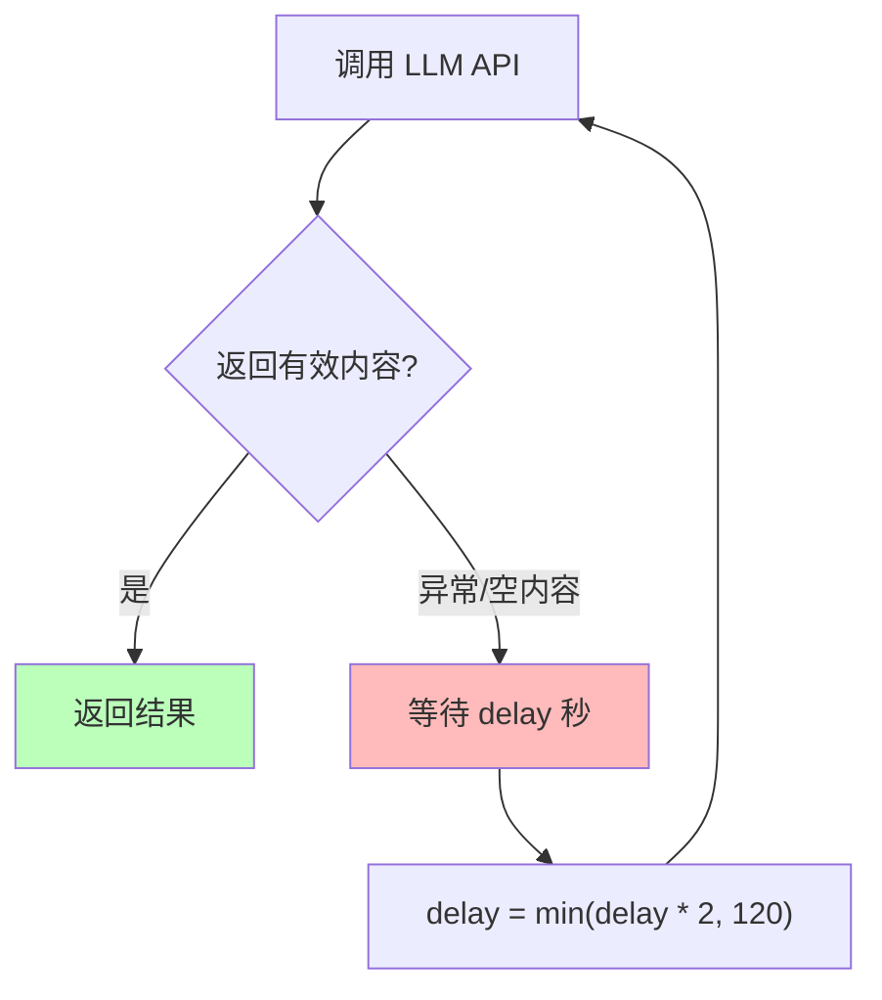

```python
def _llm_call_with_retry(client, model, messages, ...):
    delay = 5
    while True:
        try:
            response = client.chat.completions.create(...)
            content = msg.content or msg.reasoning or ""
            if content.strip():
                return content
        except Exception:
            pass
        time.sleep(delay)
        delay = min(delay * BACKOFF_FACTOR, MAX_DELAY)  # 5→10→20→40→80→120→120...
```

设计原则：**分类不能失败**。一个视频如果丢失分类信息，后续的 Vault 构建和检索就会断裂。所以采用无限重试 + 指数退避（5s → 10s → 20s → ... → 120s 封顶）。

### 分类 Prompt 设计

```python
CATEGORIES = [
    "RAG", "AGENT", "AI/ML", "前端", "后端",
    "DevOps", "开发", "创富", "文史哲", "感悟",
    "运动", "生活技巧", "其他",
]
```

Prompt 中不仅列出了类别名称，还包含了每类的**定义**和**区分规则**（如「开发 vs DevOps」），让 LLM 在边界情况下也能做出准确判断。

### JSON 提取容错

```python
def _extract_json(text):
    if "```json" in text:
        text = text.split("```json")[1].split("```")[0]
    elif "```" in text:
        text = text.split("```")[1].split("```")[0]
    return json.loads(text.strip())
```

LLM 经常把 JSON 包在 markdown 代码块中返回。这段代码自动剥离代码块标记，提取纯 JSON。解析失败时回退到 `"其他"` 分类。

## LLM 深度分析 modules/analyzer.py

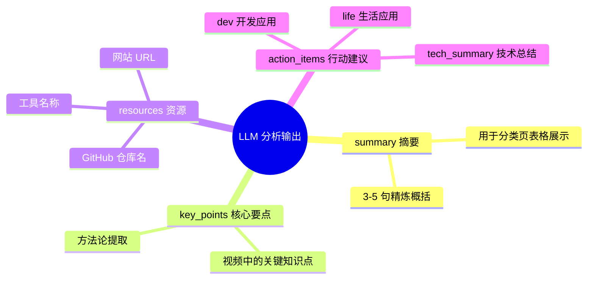

与分类模块的差异：

| | classifier | analyzer |
|---|---|---|
| 目的 | 确定类别 | 提取知识 |
| temperature | 0.1（追求确定性） | 0.3（允许创造性） |
| max_tokens | 4096 | 8192 |
| 输入 | 截断 1500 字 | 截断 4000 字 |
| 输出 | `{category, tags}` | `{summary, key_points, resources, action_items}` |

分类追求确定性（低 temperature），分析追求信息丰富度（稍高 temperature + 更大 token 预算）。

### 推理模型兼容

```python
content = msg.content or msg.reasoning or ""
```

MiniMax-M2.5 等推理模型会先输出推理过程（`reasoning`），再输出正式回答（`content`）。如果 `max_tokens` 不够大，`content` 可能为 `None`，此时回退到 `reasoning` 字段。这就是为什么分析请求的 `max_tokens` 设为 8192——给推理过程留出足够空间。

## Obsidian Vault 构建 build_vault.py

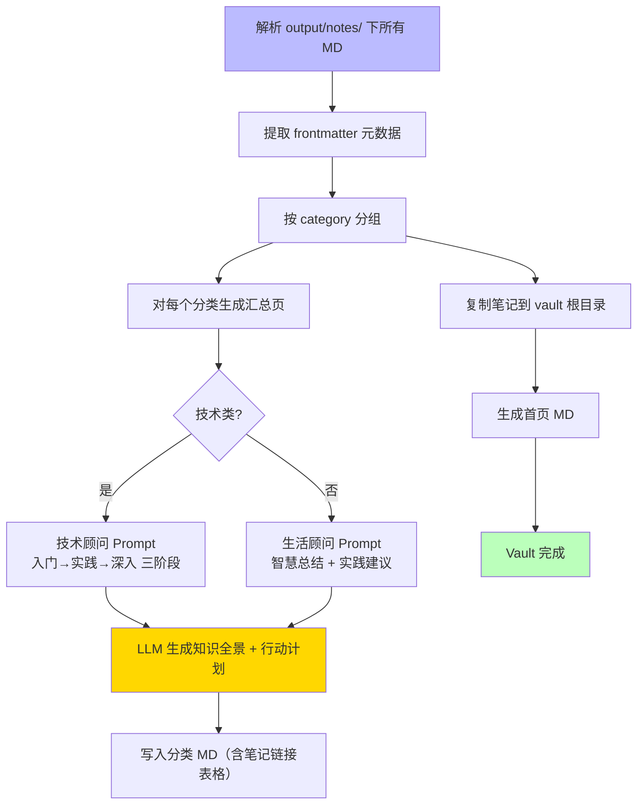

### 统一配置读取

```python
def _load_llm_config():
    cfg_path = Path("config.yaml")
    if cfg_path.exists():
        cfg = yaml.safe_load(f)
        llm = cfg.get("llm", {})
        return llm.get("api_key"), llm.get("base_url"), llm.get("model")
    return os.environ.get("LLM_API_KEY", ""), ...
```

`build_vault.py` 和 `reclassify.py` 都通过这个函数从 `config.yaml` 读取 LLM 配置。找不到 `config.yaml` 时回退到环境变量。

### 文件名清理

```python
safe_title = re.sub(
    r'[#*?:"<>|/\\（）【】｛｝《》「」：；！？…—\-]',
    '', title
)[:50].strip()
```

微信视频号标题常含全角括号 `（）`、全角冒号 `：`，这些字符在 Obsidian 的 wikilink 中会导致链接解析异常。清理后只保留安全字符，截断到 50 字符避免文件名过长。

### 笔记去重

```python
short_id = stem.rsplit("_", 1)[-1]
if short_id in seen:
    continue
seen.add(short_id)
```

从文件名提取视频 ID 作为唯一标识，跳过重复视频。

### 技术类 vs 非技术类的不同 Prompt

```python
is_tech = cat in ("RAG", "AGENT", "AI/ML", "前端", "后端", "DevOps")
```

技术类分类用「资深技术顾问」角色，输出三阶段行动计划（入门→实践→深入），要求引用具体 GitHub 仓库名。非技术类用「智慧的生活顾问」角色，输出 3-8 条实践建议。

### Obsidian 链接处理

分类页的笔记表格使用 `[[filename]]` 链接，而不是 `[[filename|显示名]]`。因为 Markdown 表格用 `|` 分隔列，Obsidian 链接中的 `|` 会被表格解析器截断。

## 重新分类 reclassify.py

当你对自动分类不满意时，可以单独运行：

```bash
python reclassify.py
```

它会：
1. 读取所有笔记的 frontmatter 和摘要
2. 用更详细的分类 Prompt（包含 13 类的定义和区分规则）重新分类
3. 写回 frontmatter 中的 `category` 和 `tags`

与初次分类的区别：reclassify 使用了**更详细的 Prompt**，包含每类的定义和 6 条区分规则，分类准确率更高。初次分类为了速度，Prompt 较简短。

## Jinja2 模板 templates/obsidian.md

```jinja2
---
title: "{{ title }}"
category: "{{ category }}"
tags:
  - {{ tag }}

---

> [!summary] 摘要
> {{ summary }}

## ✅ 可行动建议
### 💻 开发应用

- [ ] {{ item }}


<details>
<summary>点击展开完整转录文字</summary>
{{ transcript }}
</details>
```

关键设计：
- **Frontmatter**：Obsidian 原生识别 `tags` 列表，可以直接在标签面板中筛选
- **Callout**：`> [!summary]` 是 Obsidian 原生语法，渲染为蓝色提示框
- **Checkbox**：`- [ ]` 是 Obsidian 任务列表，可在笔记中直接勾选完成
- **Details 折叠**：转录文字可能数千字，折叠后不影响阅读体验

## 踩坑记录

### 坑 1：WSL 下 CUDA 库找不到

**现象**：`RuntimeError: Library libcublas.so.12 is not found`

**原因**：WSL 环境下 CUDA 运行库不在系统 `LD_LIBRARY_PATH` 中。`ctranslate2` 在 Python 启动时（而非 import 时）就尝试 `dlopen` CUDA 库。

**解决**：`run.sh` 在 Python 进程启动前设置 `LD_LIBRARY_PATH`。可以从系统中其他已安装 CUDA 的 venv 中复用库路径。关键点：**必须在进程启动前设置**，Python 运行时修改 `os.environ` 无效。

### 坑 2：推理模型 max_tokens 太小

**现象**：LLM 返回 `content: None`，只有 `reasoning` 有内容

**原因**：推理模型先输出推理过程，再输出正式回答。`max_tokens=200` 只够推理阶段消耗，正式回答被截断。

**解决**：分类 `max_tokens=4096`，分析 `max_tokens=8192`。同时在代码中回退到 `msg.reasoning`。

### 坑 3：Obsidian 表格中链接断裂

**现象**：表格中 `[[文件名|显示名]]` 点击后无法跳转

**原因**：Markdown 表格用 `|` 分隔列。链接中的 `|` 被表格解析器当成了列分隔符。

**解决**：表格中只用 `[[文件名]]`，不使用显示名。

### 坑 4：WSL 路径无法在 Obsidian 中打开

**现象**：通过 `\\wsl$\` 路径打开 vault，报 `EISDIR` 错误

**原因**：Obsidian 的文件监视器基于 `inotify`/`ReadDirectoryChangesW`，不支持 WSL 网络文件系统。

**解决**：`cp -r obsidian_vault /mnt/c/Users/xxx/Documents/` 复制到 Windows 本地路径。

### 坑 5：文件名含全角特殊字符

**现象**：部分笔记链接跳转失败

**原因**：微信视频号标题含全角 `（）`、`：` 等，Obsidian 某些版本解析异常。

**解决**：`build_vault.py` 中统一用正则清理文件名。

## 扩展与自定义

### 添加新分类

编辑 `config.yaml` 的 `categories` 列表，同时更新 `modules/classifier.py` 的 `CATEGORIES` 列表和 `build_vault.py` 的 `CATEGORY_EMOJI` 字典。

### 切换 LLM 提供商

只改 `config.yaml` 的 `llm` 部分，所有脚本自动适配。兼容任何 OpenAI API 格式的提供商。

### 自定义 Obsidian 模板

编辑 `templates/obsidian.md`，支持所有 Jinja2 语法。可用变量：`title`、`author`、`date`、`category`、`tags`、`summary`、`key_points`、`resources`、`action_items`、`transcript`。

### 处理非微信视频

流水线不绑定微信。任何 `.mp4/.avi/.mov/.mkv/.flv/.webm` 文件都可以处理，只需放入 `downloads/` 目录即可。

---

## 写在最后

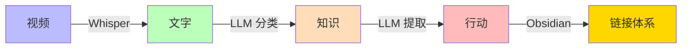

从「收藏吃灰」到「知识入库」，核心转变是**从被动收藏变为主动结构化**：

1. **视频 → 文字**：Whisper 把语音变成可检索的文本
2. **文字 → 分类**：LLM 把杂乱的内容归入有意义的类别
3. **分类 → 行动**：LLM 从内容中提取可执行的建议和具体资源
4. **行动 → 链接**：Obsidian 的双向链接把所有知识串联起来

你不再需要在 262 个视频中翻找某个技术方案，而是打开 Obsidian，进入「RAG」分类，看到知识全景总结，找到「动手实践」阶段的某个行动项，点击链接跳转到原始笔记，查看详细内容和资源链接，然后直接开始实验。

这才是知识管理应有的样子。
