# 从「收藏吃灰」到「知识入库」：用 AI 流水线把微信视频号收藏变成 Obsidian 个人知识库

> 你的微信视频号收藏了多少视频？几十个？上百个？收藏的时候觉得「这个有用，回头再看」，结果再也没打开过。
>
> 本文介绍一套完整的 AI 自动化方案：批量下载视频号收藏 → 语音转文字 → 智能分类 → 生成结构化笔记 → 导入 Obsidian 知识库。全程本地 GPU 运行 Whisper，配合大模型做内容分析和分类，262 条短视频从原始视频变成可检索、可跳转、可行动的知识体系。

## 整体流程概览

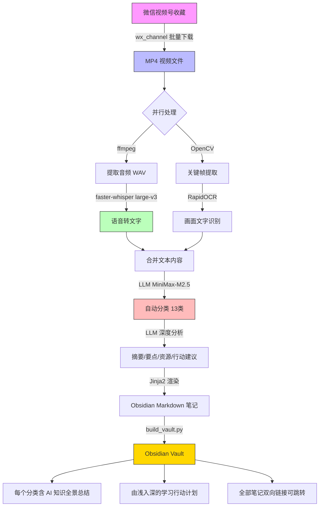

**硬件环境**：Ubuntu WSL + NVIDIA RTX 3070 Ti (8GB VRAM)

**费用**：Whisper/OCR/ffmpeg 全部免费本地运行，唯一付费项是 LLM API（分类+分析），本文使用 MiniMax-M2.5 模型。

---

## 第一步：安装 Obsidian

Obsidian 是一款本地化的 Markdown 笔记管理工具，支持双向链接、标签系统、图谱视图，非常适合做知识库。

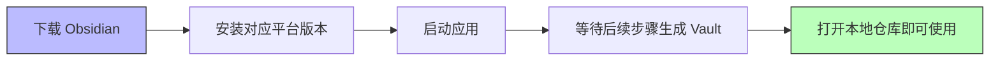

### 下载安装

访问 [obsidian.md](https://obsidian.md) 下载对应平台的安装包：

- Windows：下载 `.exe` 安装程序，双击安装
- macOS：下载 `.dmg`，拖入 Applications
- Linux：下载 `.AppImage`，赋予执行权限后运行

[截图占位：Obsidian 官网下载页面]

### 首次启动

安装完成后启动 Obsidian，会看到一个简洁的欢迎界面。此时不需要创建仓库——后续步骤会生成一个完整的 Vault 目录，直接用 Obsidian 打开即可。

---

## 第二步：下载视频号收藏视频

### 工具选择：wx_channel

[wx_channel](https://github.com/nobiyou/wx_channel) 是一个专门用于批量下载微信视频号内容的开源工具，支持下载「我的收藏」和「点赞」页面的视频。

> ⚠️ 此工具仅支持 Windows 平台，需要在 Windows PC 上登录微信后使用。

### 下载和安装

1. 前往 [GitHub Releases](https://github.com/nobiyou/wx_channel/releases) 下载最新版 `wx_channel.exe`（当前 v5.6.1）
2. 将 exe 文件放在任意目录
3. **以管理员身份运行** `wx_channel.exe`（首次运行会自动安装证书）

[截图占位：wx_channel.exe 运行界面]

### 批量下载收藏视频

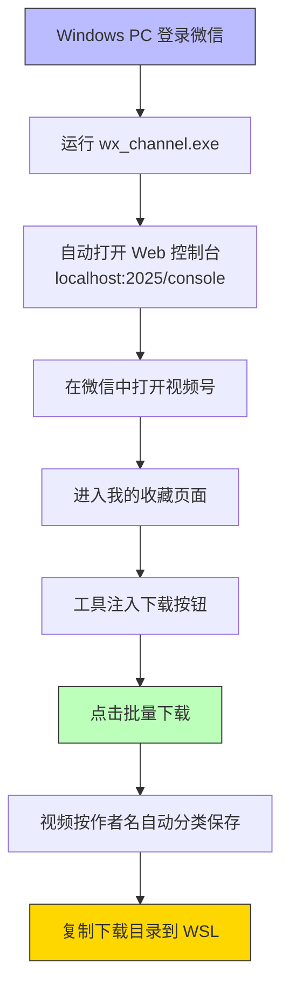

1. 在 Windows PC 上登录微信
2. 运行 `wx_channel.exe`，会自动打开 Web 控制台 `http://localhost:2025/console`
3. 在微信中打开视频号 → 进入「我的收藏」页面
4. 工具会在页面中注入下载按钮，点击即可批量下载
5. 视频按作者名自动分类保存，目录结构如下：

```
下载目录/
├── 作者A/
│   ├── 视频标题1_ID.mp4
│   └── 视频标题2_ID.mp4
├── 作者B/
│   └── 视频标题3_ID.mp4
└── ...
```

下载完成后，将整个目录复制到 WSL 的工作目录中（例如 `~/temp/weixin_favor/downloads/`）。

---

## 第三步：搭建 AI 处理流水线

### 3.1 环境准备

```bash
# 创建工作目录
mkdir -p ~/temp/weixin_favor && cd ~/temp/weixin_favor

# 创建 Python 虚拟环境
python3 -m venv venv
source venv/bin/activate

# 安装依赖
pip install faster-whisper opencv-python-headless rapidocr-onnxruntime \
    openai pyyaml jinja2 numpy loguru rich
```

**核心依赖说明**：

| 包名 | 用途 |
|------|------|
| `faster-whisper` | 基于 CTranslate2 的 Whisper 实现，支持 int8 量化，8GB 显卡可用 |
| `opencv-python-headless` | 关键帧提取，场景变化检测 |
| `rapidocr-onnxruntime` | 轻量级 OCR，用于识别视频画面中的文字（代码截图、PPT 等） |
| `openai` | OpenAI 兼容 API 客户端，用于调用 LLM 做分类和分析 |
| `jinja2` | 模板引擎，渲染 Obsidian 笔记 |

### 3.2 配置文件

创建 `config.yaml`：

```yaml
whisper:
  model_size: "large-v3"       # Whisper 模型，中文效果最佳
  device: "cuda"                # 使用 GPU
  compute_type: "int8_float16"  # 8GB 显卡用 int8 量化
  language: "zh"                # 中文

llm:
  api_key: "sk-your-api-key"    # 替换为你的 API Key
  base_url: "https://api.openai.com/v1"  # 或其他兼容接口
  model: "gpt-4o"              # 或其他模型

frames:
  threshold: 30.0               # 场景变化阈值
  max_frames: 20                # 每个视频最多提取 20 帧

ocr:
  confidence_threshold: 0.5     # OCR 置信度过滤

paths:
  downloads: "./downloads"      # 视频输入目录
  output: "./output"
  transcripts: "./output/transcripts"
  notes: "./output/notes"
  frames: "./output/frames"
```

**LLM 配置说明**：流水线使用 OpenAI 兼容接口，支持任意提供商。实测以下方案均可：

| 方案 | 费用 | base_url | 说明 |
|------|------|----------|------|
| DeepSeek | 极低（~¥1/百万 token）| `https://api.deepseek.com/v1` | 性价比最高 |
| 硅基流动 | 注册送额度 | `https://api.siliconflow.cn/v1` | 免费试用 |
| Ollama 本地 | 完全免费 | `http://localhost:11434/v1` | 有 8GB 显卡可跑 7B 模型 |
| 智谱 GLM | 有免费额度 | `https://open.bigmodel.cn/api/paas/v4` | 国产模型 |
| MiniMax-M2.5 | 按量计费 | 对应 API 地址 | 本文明使用的模型 |

### 3.3 WSL 下的 CUDA 配置

如果你的 WSL 环境中 CUDA 库不在系统路径中，需要额外配置。检查方式：

```bash
python -c "import ctranslate2; print(ctranslate2.get_supported_compute_types('cuda'))"
```

如果报错 `Library libcublas.so.12 is not found`，说明需要配置 CUDA 库路径。

**解决方案**：创建启动脚本 `run.sh`，在 Python 启动前注入环境变量：

```bash
#!/bin/bash
SCRIPT_DIR="$(cd "$(dirname "$0")" && pwd)"

# 自动查找 nvidia CUDA 库路径（从其他 venv 中复用）
CUDA_BASE="/path/to/your/venv/lib/python3.12/site-packages/nvidia"
CUDA_LIBS=""
for dir in "$CUDA_BASE"/*/lib; do
    [ -d "$dir" ] && CUDA_LIBS="${CUDA_LIBS:+$CUDA_LIBS:}$dir"
done

export LD_LIBRARY_PATH="${CUDA_LIBS}${LD_LIBRARY_PATH:+:$LD_LIBRARY_PATH}"

source "${SCRIPT_DIR}/venv/bin/activate"
cd "$SCRIPT_DIR"
python pipeline.py "$@"
```

赋予执行权限：`chmod +x run.sh`

> ⚠️ `LD_LIBRARY_PATH` 必须在 Python 进程启动前设置。Python 运行时修改无效，因为动态链接器在进程启动时就完成了库加载。

---

## 第四步：核心模块详解

整个流水线由 5 个核心模块组成，逐一讲解。

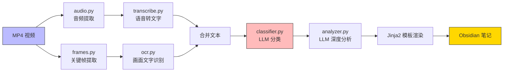

### 4.1 音频提取（modules/audio.py）

使用 ffmpeg 从视频中提取 16kHz 单声道 WAV——这是 Whisper 最优的输入格式。

```python
def extract_audio(video_path: str, output_path: str) -> str:
    cmd = [
        "ffmpeg",
        "-i", str(video),
        "-vn",                   # 不要视频流
        "-acodec", "pcm_s16le",  # PCM 16-bit 编码
        "-ar", "16000",          # 16kHz 采样率（Whisper 最优）
        "-ac", "1",              # 单声道
        "-y",                    # 覆盖已有文件
        str(output),
    ]
    result = subprocess.run(cmd, capture_output=True, text=True, timeout=600)
    # ... 错误处理省略
```

**关键参数**：`-ar 16000 -ac 1` 是 Whisper 模型要求的输入格式，采样率不匹配会显著降低识别准确率。

### 4.2 语音转文字（modules/transcribe.py）

使用 `faster-whisper` 加载 large-v3 模型，int8_float16 量化后仅需约 3GB 显存：

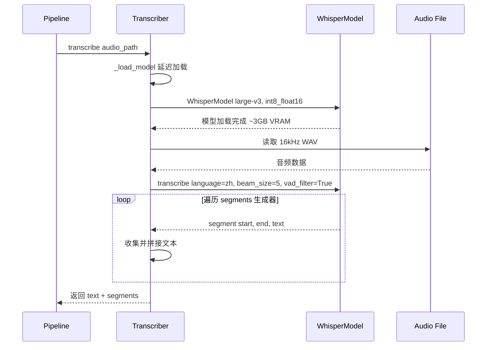

```python
class Transcriber:
    def __init__(self, model_size="large-v3", device="cuda",
                 compute_type="int8_float16"):
        self.model_size = model_size
        self.device = device
        self.compute_type = compute_type
        self._model = None

    def _load_model(self):
        # 延迟加载，避免 import 时占用显存
        from faster_whisper import WhisperModel
        self._model = WhisperModel(
            self.model_size,
            device=self.device,
            compute_type=self.compute_type,
        )

    def transcribe(self, audio_path: str) -> dict:
        self._load_model()
        segments_iter, info = self._model.transcribe(
            str(audio),
            language="zh",      # 中文
            beam_size=5,        # beam search 宽度
            vad_filter=True,    # 语音活动检测，过滤静音段
            vad_parameters=dict(
                min_silence_duration_ms=500,
                speech_pad_ms=200,
            ),
        )
        # 将生成器结果收集为列表，拼接完整文本
        for seg in segments_iter:
            segments.append({"start": seg.start, "end": seg.end,
                           "text": seg.text.strip()})
        return {"text": full_text, "segments": segments}
```

**核心设计**：

- **延迟加载**：`_model` 初始为 `None`，首次调用 `transcribe()` 时才加载模型。这样不会在 import 时就占满显存
- **VAD 过滤**：开启 `vad_filter=True` 自动跳过静音段，对短视频特别有效（很多视频开头有几秒空白）
- **int8_float16 量化**：large-v3 模型全精度需要 ~10GB 显存，int8 量化后仅需 ~3GB，精度损失可忽略

首次运行会从 HuggingFace 下载模型（约 3GB），后续自动缓存。可通过配置 HF token 加速：

```bash
pip install huggingface_hub
huggingface-cli login --token hf_your_token
```

### 4.3 关键帧提取与 OCR（modules/frames.py + modules/ocr.py）

很多技术视频会在画面中展示代码、PPT、架构图。单纯语音转文字会丢失这些视觉信息。

**关键帧提取**使用 OpenCV 的 HSV 直方图对比检测场景切换：

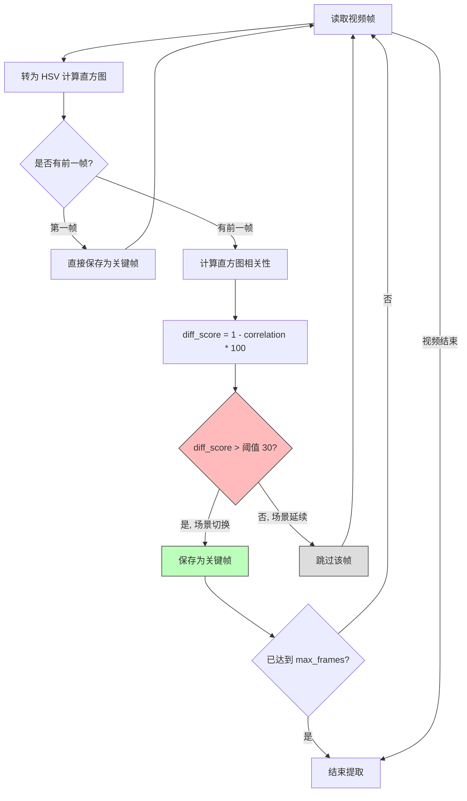

```python
def extract_keyframes(video_path, output_dir, threshold=30.0, max_frames=20):
    cap = cv2.VideoCapture(str(video))
    prev_hist = None

    while True:
        ret, frame = cap.read()
        if not ret:
            break

        current_hist = compute_hsv_histogram(frame)

        if prev_hist is None:
            # 第一帧总是保存
            save_frame(frame, ...)
            prev_hist = current_hist
            continue

        # 计算与上一关键帧的直方图相关性
        correlation = cv2.compareHist(prev_hist, current_hist, cv2.HISTCMP_CORREL)
        diff_score = (1.0 - correlation) * 100.0

        if diff_score > threshold:
            save_frame(frame, ...)
            prev_hist = current_hist
```

**原理**：将每帧转为 HSV 色彩空间的直方图特征向量，用相关性系数衡量相邻帧的视觉差异。差异超过阈值（默认 30）时认为发生了场景切换，保存该帧。

**OCR** 使用 RapidOCR 对关键帧做文字识别：

```python
class OCRProcessor:
    def extract_text(self, image_path: str) -> str:
        result, _ = self._engine(str(img))
        texts = [item[1] for item in result if item[2] >= self.confidence_threshold]
        return " ".join(texts)
```

自动过滤置信度低于 0.5 的结果，避免噪声。

### 4.4 LLM 分类（modules/classifier.py）

这是流水线中最关键的部分之一——让 LLM 根据视频内容自动分类。分类标准经过精心设计：

```python
CATEGORIES = [
    "RAG",       # 检索增强生成、向量检索、知识库问答、Query改写
    "AGENT",     # AI智能体开发、Skills、MCP、Claude Code
    "AI/ML",     # 大模型通用、AI工具推荐、模型训练
    "前端",      # 前端框架、UI/UX设计、CSS
    "后端",      # 后端架构、数据库、API设计
    "DevOps",    # 运维、HTTPS、CI/CD、云服务
    "开发",      # 通用开发工具、GitHub项目、建站
    "创富",      # 创业、投资理财、金融、运营
    "文史哲",    # 历史、文学、哲学思想
    "感悟",      # 个人成长、心理疗愈、认知觉醒
    "运动",      # 户外运动、徒步、自驾
    "生活技巧",  # 健康养生、职场、社保
    "其他",      # 无法归类的
]
```

分类 Prompt 的设计包含**区分规则**，避免常见混淆：

```
分类关键区分规则：
- 「开发」vs「DevOps」：开发=工具/项目；DevOps=部署/运维/HTTPS
- 「创富」vs「感悟」：涉及赚钱/商业→创富；纯心灵感悟→感悟
- 「文史哲」vs「感悟」：具体哲学体系(王阳明/国学)→文史哲；个人情感→感悟
```

**重要设计：无限重试**。LLM API 可能因网络波动返回错误，分类不能失败——否则笔记会丢失分类信息。所以采用指数退避的无限重试：

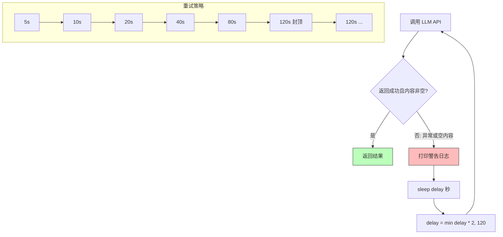

```python
def _llm_call_with_retry(client, model, messages, ...):
    delay = 5  # 初始 5 秒
    while True:
        try:
            response = client.chat.completions.create(...)
            content = msg.content or msg.reasoning or ""
            if content.strip():
                return content
        except Exception as e:
            logger.warning("LLM 失败, {}s 后重试", delay)
        time.sleep(delay)
        delay = min(delay * 2, 120)  # 最大 120 秒
```

重试策略：5s → 10s → 20s → 40s → 80s → 120s（封顶）→ 120s → ... 直到成功。

### 4.5 LLM 深度分析（modules/analyzer.py）

每个视频经过分类后，再用 LLM 做深度内容分析，提取四类信息：

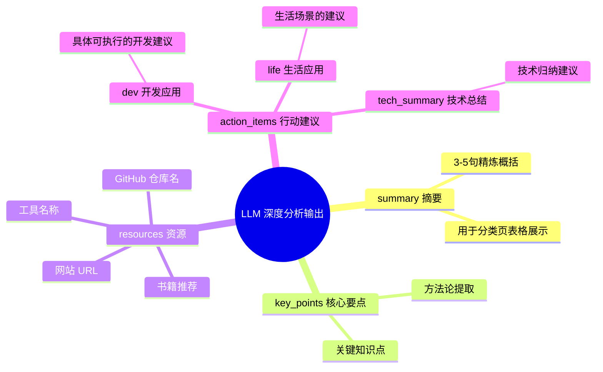

```python
_ANALYZE_PROMPT = """
分析视频内容，输出 JSON：
{
  "summary": "3-5句摘要",
  "key_points": ["核心要点"],
  "resources": ["提到的工具/网站/书籍/框架"],
  "action_items": {
    "dev": ["开发应用建议"],
    "life": ["生活应用建议"],
    "tech_summary": ["技术总结建议"]
  }
}
"""
```

**Prompt 设计思路**：

1. **摘要**：3-5 句精炼概括，用于分类页的表格展示
2. **核心要点**：提取视频中的关键知识点或方法论
3. **资源**：视频提到的具体工具名、GitHub 仓库名、网站 URL，这是最实用的信息
4. **行动建议**：分三类（开发/生活/技术总结），每条建议要具体可执行

### 4.6 Obsidian 笔记模板

每条视频最终渲染为一个 Obsidian Markdown 文件：

```markdown
---
title: "视频标题"
author: "作者"
date: "2026-04-12"
category: "AGENT"
tags:
  - AI编程
  - Claude Code
source: "微信视频号收藏"
---

# 视频标题

> [!summary] 摘要
> AI 生成的 3-5 句话摘要

## 📌 核心要点
- 要点1
- 要点2

## 🔗 资源与工具
- Claude Code - AI编程助手
- Opus 4.5 - 大语言模型

## ✅ 可行动建议

### 💻 开发应用
- [ ] 具体可执行的开发建议

### 🏠 生活应用
- [ ] 生活应用建议

### 📝 技术总结
- [ ] 技术总结建议

---

## 📜 原始文稿

<details>
<summary>点击展开完整转录文字</summary>

Whisper 转录的完整文字内容

</details>
```

**设计要点**：

- **Frontmatter**：YAML 格式的元数据，Obsidian 可直接识别 `tags` 和 `category`
- **Callout 语法**：`> [!summary]` 是 Obsidian 的原生 callout 语法，渲染为带颜色的提示框
- **Checkbox**：`- [ ]` 是 Obsidian 原生的任务列表语法，可在笔记中直接勾选
- **Details 折叠**：原始转录文字用 HTML `<details>` 标签折叠，不影响阅读体验

---

## 第五步：运行流水线

### 处理视频

```bash
# 确保在虚拟环境中
source venv/bin/activate

# 处理单个视频（测试用）
./run.sh "./downloads/260411/作者名/某个视频.mp4"

# 批量处理整个目录
./run.sh "./downloads/260411/"
```

[截图占位：pipeline 运行过程，Rich 进度条显示]

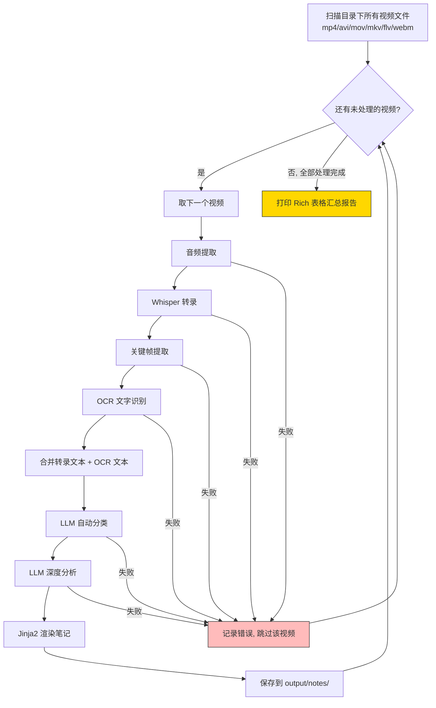

流水线会：
1. 递归扫描目录下所有 `.mp4/.avi/.mov/.mkv/.flv/.webm` 文件
2. 逐个处理：音频提取 → 转录 → 关键帧 → OCR → 分类 → 分析 → 生成笔记
3. 失败的视频自动跳过，继续处理下一个
4. 处理完成后打印 Rich 表格汇总报告

[截图占位：处理报告表格，显示每个视频的分类和标签]

### 中间产物清理

处理完成后，`output/frames/` 目录中会保存所有视频的关键帧截图和音频文件（约 2GB），这些是中间产物，OCR 文字已提取完毕，可以安全删除：

```bash
rm -rf output/frames/*
```

最终只需保留：
- `output/transcripts/` — 纯文本转录稿（~1.5MB）
- `output/notes/` — Obsidian Markdown 笔记（~1.8MB）

---

## 第六步：生成 Obsidian 知识库

### 6.1 Vault 构建脚本

`build_vault.py` 脚本负责将 261 篇笔记整理为结构化的 Obsidian Vault：

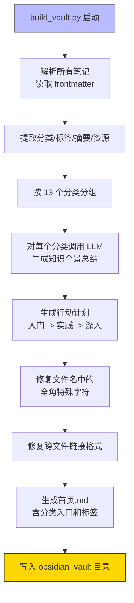

**核心功能**：

1. **解析所有笔记**：读取 frontmatter，提取分类、标签、摘要、资源
2. **LLM 分类汇总**：对每个分类下的所有笔记，调用 LLM 生成知识全景总结
3. **生成行动计划**：技术类分为「入门→实践→深入」三阶段，标注具体资源和笔记来源
4. **修复链接格式**：清理文件名中的全角特殊字符（Obsidian 不友好），确保跨文件链接可用

```python
# 文件名清理：去掉全角符号，避免 Obsidian 链接解析问题
safe_title = re.sub(
    r'[#*?:"<>|/\\（）【】｛｝《》「」：；！？…—-]',
    '', title
)[:50].strip()
```

**分类页面的 LLM Prompt 设计**（以技术分类为例）：

```
你是一位资深技术顾问。以下是「AGENT」分类下的 43 篇技术笔记摘要。

任务一：知识全景总结
- 核心关注点和趋势
- 关键技术/方法的共性发现
- 值得深入学习的方向

任务二：学习与行动计划（由浅入深）
- 🌱 入门了解：基础概念，推荐阅读哪些笔记
- 🔧 动手实践：可立即尝试的工具，引用具体 GitHub 仓库名
- 🚀 深入研究：进阶方向

每个行动项标注来源笔记编号，如果提到了开源项目必须写明名称。
```

### 6.2 构建和部署

```bash
# 生成 Vault
source venv/bin/activate
python build_vault.py

# 复制到 Windows（WSL 环境）
rm -rf /mnt/c/Users/你的用户名/Documents/obsidian_vault
cp -r obsidian_vault /mnt/c/Users/你的用户名/Documents/
```

[截图占位：build_vault.py 运行输出]

### 6.3 在 Obsidian 中打开

1. 启动 Obsidian
2. 点击「管理仓库」→「打开本地仓库」
3. 选择 `C:\Users\你的用户名\Documents\obsidian_vault` 文件夹
4. 打开「🏠 首页.md」作为入口

> ⚠️ 不要通过 `\\wsl$\` 路径直接打开 WSL 目录，Obsidian 的文件监视器不支持 WSL 的网络文件系统，会报 `EISDIR` 错误。必须先复制到 Windows 本地路径。

[截图占位：Obsidian 打开 vault 后的首页]

---

## 第七步：分类原则详解

经过反复调优，最终确定了 13 个分类，以及严格的分类边界规则：

### 分类列表

| 分类 | 定义 | 典型内容 |
|------|------|---------|
| **RAG** | 检索增强生成相关技术 | 向量检索、Query改写、文档解析、Embedding、知识库问答 |
| **AGENT** | AI 智能体开发相关 | Skills、MCP、Claude Code 使用、多智能体编排、Computer Use |
| **AI/ML** | 大模型和 AI 通用技术 | 模型训练/微调、AI 产品经理、AI 行业趋势、语音识别、TTS |
| **前端** | 前端开发和 UI 设计 | React/Vue/TypeScript、CSS、UI 框架、页面交互 |
| **后端** | 后端架构和系统设计 | 数据库、API 设计、服务器、Token 认证 |
| **DevOps** | 运维和基础设施 | HTTPS/SSL、CI/CD、Docker、云服务、域名、监控 |
| **开发** | 通用开发工具和效率 | GitHub 项目、开源工具、建站工具、PDF 处理 |
| **创富** | 创业、投资和商业 | 创业经验、投资理财、金融知识、运营、副业、IP 打造 |
| **文史哲** | 人文历史哲学 | 王阳明心学、国学、历史故事、文学诗词、哲学思想 |
| **感悟** | 个人内心成长 | 心理疗愈、认知觉醒、人生哲理、自我提升（非技术非商业） |
| **运动** | 户外和旅行 | 徒步、骑行、自驾攻略、旅行路线 |
| **生活技巧** | 实用生活知识 | 健康养生、职场技巧、社保、税收、科普 |
| **其他** | 无法归类的内容 | 游戏推荐、影视、纯娱乐 |

### 关键分类边界规则

以下是 LLM 分类时使用的区分规则，解决了最容易混淆的边界情况：

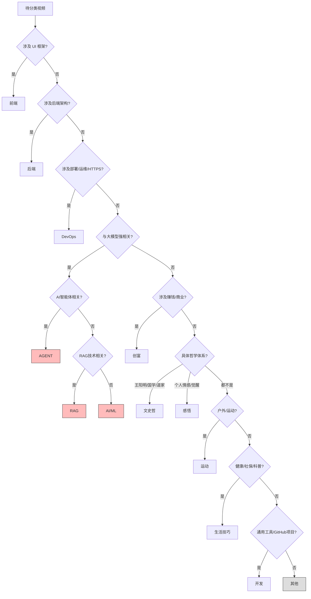

- **「开发」vs「DevOps」**：涉及工具使用、GitHub 项目归「开发」；涉及部署、HTTPS、服务器、域名归「DevOps」
- **「开发」vs「前端/后端」**：明确涉及 UI 框架归「前端」；涉及后端架构归「后端」；通用工具归「开发」
- **「开发」vs「AI/ML」**：与大模型强相关的归「AI/ML」；通用技术工具（如 PDF 解析引擎）归「开发」
- **「创富」vs「感悟」**：涉及赚钱/商业/创业/投资 →「创富」；纯心灵感悟/人生哲学 →「感悟」
- **「文史哲」vs「感悟」**：涉及具体哲学体系（王阳明/国学/道家） →「文史哲」；个人情感/认知觉醒 →「感悟」
- **「运动」vs「生活技巧」**：户外活动/徒步/自驾路线 →「运动」；健康知识/社保/科普 →「生活技巧」

### 实际分类结果

对 262 条视频的实际分类结果：

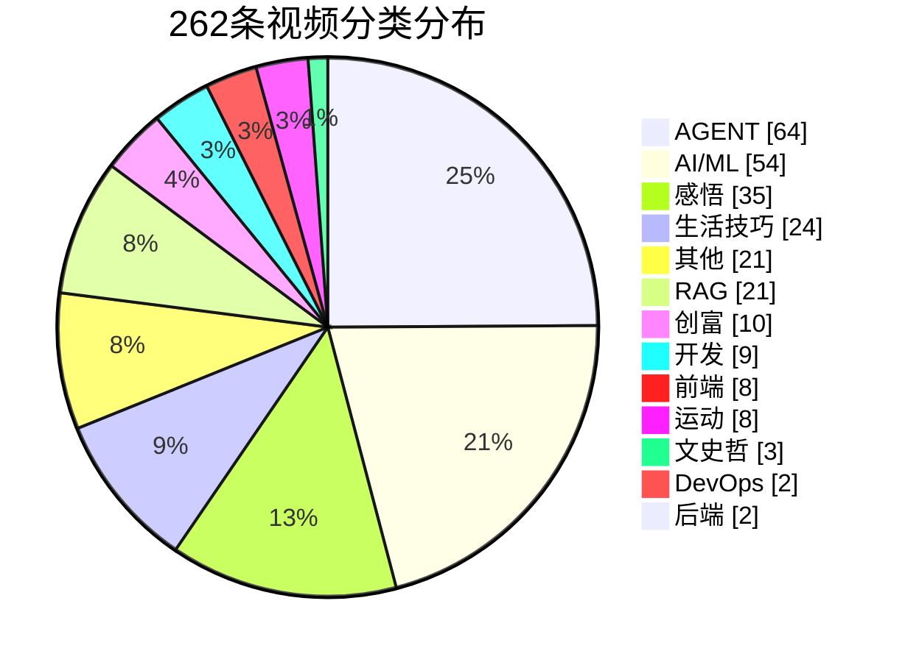

```
🤖 AGENT    64 篇  ┃  💰 创富    10 篇
🧠 AI/ML    54 篇  ┃  💻 开发     9 篇
💡 感悟     35 篇  ┃  🎨 前端     8 篇
🏠 生活技巧  24 篇  ┃  🏃 运动     8 篇
📎 其他     21 篇  ┃  📜 文史哲    3 篇
🔍 RAG      21 篇  ┃  🔧 DevOps   2 篇
                    ┃  ⚙️ 后端     2 篇
```

---

## 最终效果展示

### 首页：视频号知识库

Obsidian 首页展示全局概览：分类入口、热门标签。

[截图占位：Obsidian 首页，显示 13 个分类入口和热门标签统计]

### 分类页：知识全景 + 行动计划

每个分类页由 LLM 综合该类下所有笔记生成，包含：

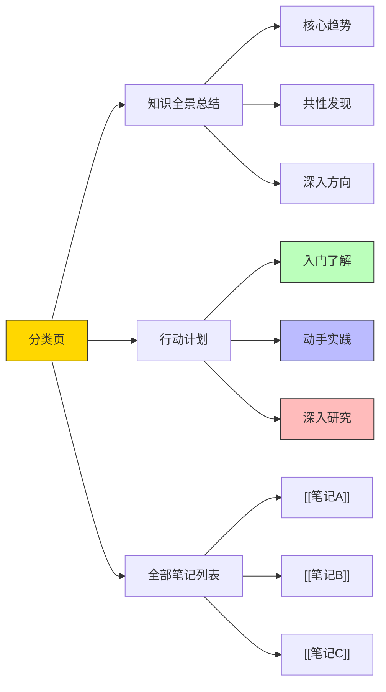

1. **知识全景总结**：该领域的核心趋势、共性发现、深入方向
2. **由浅入深的行动计划**：🌱 入门 → 🔧 实践 → 🚀 深入
3. **全部笔记列表**：带 `[[链接]]` 可跳转到具体笔记

[截图占位：AGENT 分类页，显示知识全景和行动计划表格]

**行动计划示例**（AGENT 分类）：

| 阶段 | 行动项 | 来源 |
|------|--------|------|
| 🌱 入门 | 阅读 Anthropic《Building Effective Agents》 | [笔记32] |
| 🔧 实践 | 部署 OpenManus (GitHub: AI-Agent/OpenManus) | [笔记16] |
| 🔧 实践 | 运行 learn-claude-code 12个Python脚本 | [笔记33] |
| 🚀 深入 | 研究 Claude Code 六层记忆架构 | [笔记11] |

每个行动项都引用了具体笔记编号和 GitHub 仓库名，可以直接找到来源并开始实验。

### 笔记页：结构化知识卡片

点击分类表中的链接，跳转到具体笔记：

[截图占位：单个笔记页面，显示摘要、核心要点、资源、行动建议和折叠的原始文稿]

### 笔记间的链接跳转

Obsidian 的核心能力是双向链接。在分类页中点击 `[[笔记名]]` 即可跳转：

[截图占位：从分类页点击链接跳转到具体笔记的动画演示]

---

## 踩坑记录

```mermaid
flowchart TD
    subgraph 坑1 CUDA库找不到
        A1[报错 libcublas.so.12 not found] --> A2[WSL缺少CUDA库路径]
        A2 --> A3[run.sh 启动前设置 LD_LIBRARY_PATH]
    end

    subgraph 坑2 max_tokens太小
        B1[LLM返回 content: None] --> B2[推理模型先输出推理过程]
        B2 --> B3[max_tokens从200调到4096/8192]
    end

    subgraph 坑3 表格链接断裂
        C1[分类页链接无法跳转] --> C2[竖线被表格解析器截断]
        C2 --> C3[表格链接去掉显示名只用文件名]
    end

    subgraph 坑4 WSL路径无法打开
        D1[Obsidian报 EISDIR错误] --> D2[inotify不支持WSL网络文件系统]
        D2 --> D3[复制vault到Windows本地路径]
    end

    subgraph 坑5 文件名特殊字符
        E1[部分笔记链接跳转失败] --> E2[全角括号冒号导致解析异常]
        E2 --> E3[build_vault.py统一清理全角字符]
    end

    style A3 fill:#bfb,stroke:#333
    style B3 fill:#bfb,stroke:#333
    style C3 fill:#bfb,stroke:#333
    style D3 fill:#bfb,stroke:#333
    style E3 fill:#bfb,stroke:#333
```

### 坑 1：WSL 下 CUDA 库找不到

**现象**：`RuntimeError: Library libcublas.so.12 is not found or cannot be loaded`

**原因**：WSL 环境下 CUDA 运行库可能不在系统 `LD_LIBRARY_PATH` 中。`ctranslate2`（faster-whisper 的底层引擎）在 Python 启动时就尝试加载 CUDA 库。

**解决**：通过 `run.sh` 启动脚本，在 Python 进程启动前设置 `LD_LIBRARY_PATH`。可以从系统中其他已安装 CUDA 库的 venv 中复用（如 ragflow 的 venv）。

### 坑 2：推理模型 max_tokens 太小

**现象**：LLM 返回 `content: None`，只有 `reasoning` 有内容

**原因**：MiniMax-M2.5 是推理模型，会先输出推理过程再输出正式回答。`max_tokens=200` 只够推理阶段消耗，正式回答被截断。

**解决**：将分类请求的 `max_tokens` 设为 4096，分析请求设为 8192。

### 坑 3：Obsidian 表格中链接断裂

**现象**：分类页表格中的 `[[文件名|显示名]]` 点击后无法跳转

**原因**：Markdown 表格用 `|` 分隔列。Obsidian 的 `[[文件名|显示名]]` 中的 `|` 被表格解析器当成了列分隔符，导致链接被截断。

**解决**：表格中的链接去掉显示名，只用 `[[文件名]]`。

### 坑 4：WSL 路径无法直接在 Obsidian 中打开

**现象**：通过 `\\wsl$\` 路径在 Obsidian 中打开 vault，报 `EISDIR: illegal operation on a directory, watch`

**原因**：Obsidian 的文件监视器基于 `inotify`/`ReadDirectoryChangesW`，不支持 WSL 的 `\\wsl$\` 网络文件系统。

**解决**：将 vault 复制到 Windows 本地路径（如 `C:\Users\xxx\Documents\`）后再打开。

### 坑 5：文件名含全角特殊字符

**现象**：部分笔记链接跳转失败

**原因**：微信视频号的标题常含全角括号 `（）`、全角冒号 `：`，这些字符在某些 Obsidian 版本中会导致链接解析异常。

**解决**：在 `build_vault.py` 中统一清理文件名，去掉所有全角特殊字符。

---

## 完整的项目结构

```mermaid
flowchart TD
    ROOT[weixin_favor/] --> VENV[venv/]
    ROOT --> RUN[run.sh 启动脚本]
    ROOT --> PIPE[pipeline.py 主流水线]
    ROOT --> RECL[reclassify.py 重分类]
    ROOT --> BUILD[build_vault.py Vault构建器]
    ROOT --> CONF[config.yaml 配置]
    ROOT --> REQ[requirements.txt]

    ROOT --> MOD[modules/]
    MOD --> M1[audio.py 音频提取]
    MOD --> M2[transcribe.py 语音转文字]
    MOD --> M3[frames.py 关键帧提取]
    MOD --> M4[ocr.py 画面OCR]
    MOD --> M5[classifier.py LLM分类]
    MOD --> M6[analyzer.py LLM分析]

    ROOT --> TMPL[templates/]
    TMPL --> T1[obsidian.md Jinja2模板]

    ROOT --> DL[downloads/ 视频输入]
    ROOT --> OUT[output/]
    OUT --> O1[transcripts/ 转录稿]
    OUT --> O2[notes/ Obsidian笔记]
    OUT --> O3[frames/ 关键帧中间产物]

    ROOT --> VAULT[obsidian_vault/]
    VAULT --> V1[首页.md]
    VAULT --> V2[分类/ 13个分类页]
    VAULT --> V3[261篇笔记.md]

    style ROOT fill:#ffd700,stroke:#333
    style MOD fill:#bbf,stroke:#333
    style VAULT fill:#bfb,stroke:#333
```

```
weixin_favor/
├── venv/                          # Python 虚拟环境
├── run.sh                         # 启动脚本（含 CUDA 路径注入）
├── pipeline.py                    # 主流水线入口
├── reclassify.py                  # LLM 重新分类脚本
├── build_vault.py                 # Obsidian Vault 构建器
├── config.yaml                    # 全局配置
├── requirements.txt               # Python 依赖
├── modules/
│   ├── audio.py                   # ffmpeg 音频提取
│   ├── transcribe.py              # Whisper 语音转文字
│   ├── frames.py                  # OpenCV 关键帧提取
│   ├── ocr.py                     # RapidOCR 画面文字识别
│   ├── classifier.py              # LLM 分类（含无限重试）
│   └── analyzer.py                # LLM 深度分析
├── templates/
│   └── obsidian.md                # Obsidian 笔记 Jinja2 模板
├── downloads/                     # 视频输入（wx_channel 下载）
├── output/
│   ├── transcripts/               # Whisper 转录稿
│   ├── notes/                     # 生成的 Obsidian 笔记
│   └── frames/                    # 关键帧（中间产物，可删除）
└── obsidian_vault/                # 最终的 Obsidian 知识库
    ├── 🏠 首页.md
    ├── 分类/
    │   ├── 🤖 AGENT.md            # 含 LLM 汇总 + 行动计划
    │   ├── 🔍 RAG.md
    │   ├── 💰 创富.md
    │   └── ... (13 个分类)
    ├── 📄 笔记1.md                # 261 篇笔记在根目录
    ├── 📄 笔记2.md
    └── ...
```

---

## 使用指南速查

```bash
# 1. 下载新视频后，批量处理
./run.sh "./downloads/260411/"

# 2. 重新分类（如果对分类不满意）
source venv/bin/activate
python reclassify.py

# 3. 重建 Vault
python build_vault.py

# 4. 部署到 Windows
rm -rf /mnt/c/Users/你的用户名/Documents/obsidian_vault
cp -r obsidian_vault /mnt/c/Users/你的用户名/Documents/

# 5. Obsidian 中重新打开 vault
```

---

## 写在最后

从「收藏吃灰」到「知识入库」，核心转变是**从被动收藏变为主动结构化**。AI 流水线解决的不是一个技术问题，而是一个信息管理问题：

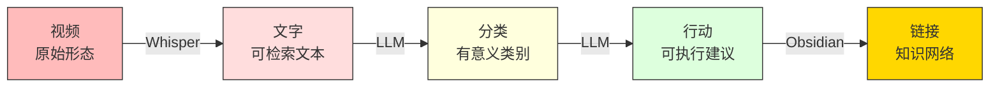

1. **视频 → 文字**：Whisper 把语音变成可检索的文本
2. **文字 → 分类**：LLM 把杂乱的内容归入有意义的类别
3. **分类 → 行动**：LLM 从内容中提取可执行的建议和具体资源
4. **行动 → 链接**：Obsidian 的双向链接把所有知识串联起来

最终的效果是：你不再需要在 262 个视频中翻找某个技术方案，而是打开 Obsidian，进入「🔍 RAG」分类，看到知识全景总结，找到「动手实践」阶段的某个行动项，点击链接跳转到原始笔记，查看详细内容和资源链接，然后直接开始实验。

这才是知识管理应有的样子。
